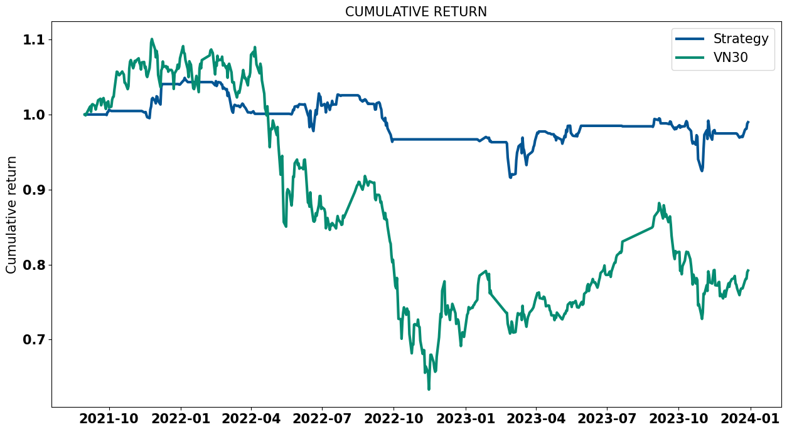

# Statistical Arbitrage

## Abstract
Financial markets are inherently noisy, providing opportunities for algorithmic strategies to exploit pricing inefficiencies. This report develops a statistical arbitrage strategy inspired by Avellaneda and Lee, adapted for the Vietnamese stock market, where short selling of individual stocks is prohibited. I propose longing a basket of stocks and shorting the VN30F1M futures contract to capture mean-reverting relationships. I formed combinations by employing clustering techniques, the Johansen cointegration test, and generate signals by using the s-score of the Ornstein-Uhlenbeck process. After the backtesting, I found that the key things depends on how the trading signal is designed and additional efforts (time and computational power) should be implemented for the best performance of the model

## Introduction
### Hypothesis
In the Vietnamese stock market, dominated by retail investors, stocks exhibit exaggerated price movements due to overreactions to news or sentiment. These deviations from fundamental values result in wider spreads between stock baskets and the VN30F1M futures, which revert to their historical mean, enabling profitable trades via algorithmic mean-reversion strategies. 
### Key Idea
Statistical arbitrage is a popular algorithmic trading strategy that delivers market-neutral returns, independent of market trends. It attracts investors with its diversification benefits and high-reward, low-risk potential—similar to earning high interest from a bank but with greater upside.

This strategy uses statistical methods to exploit pricing inefficiencies, often via mean-reverting portfolios. A classic example, pairs trading, involves trading two correlated securities (long one, short the other) when their price spread diverges, expecting it to revert. The model is:

$$ \frac{dP_t}{P_t} = \alpha \, dt + \beta \frac{dQ_t}{Q_t} + dX_t $$

Here, $P_t$ and $Q_t$ are stock prices, $\alpha$ is a drift (often small), $\beta$ is the hedge ratio, and $X_t$ is a mean-reverting residual guiding trades.

In Vietnam, short-selling stocks is banned, making pairs trading unfeasible. Instead, this strategy longs a basket of stocks and shorts the VN30F1M futures contract to stay market-neutral. The goal is to find:

$$ \text{VN30F1M} = \text{intercept} + \sum_{i} \beta_i \cdot \text{stock}_i + \text{residual} $$

where the residual is stationary. 
## Related Work

Statistical arbitrage is well-documented in finance. Avellaneda and Lee (2010) modeled pairs trading with cointegration and the Ornstein-Uhlenbeck process, where the spread \( $X_t$ \) follows:

$$ dX_t = \kappa (\mu - X_t) \, dt + \sigma \, dW_t $$

Here, \( $\kappa$ \) is the reversion speed, \( $\mu$ \) is the mean, and \( $\sigma$ \) is volatility, with trades based on the s-score. O-U parameters are estimated via an AR(1) model:

$$ X_{n+1} = a + b X_n + \theta_{n+1} $$

Stanford students (Lu, Parulekar, Xu, 2018) proposed clustering and the Johansen Test for cointegration—unlike the Engel-Granger test, it handles multiple cointegration relationships—enhancing stock-future cointegration analysis.
## Data
The data is taken from Algotrade Database from 06/2021-12/2024 using the daily closing price.
Data is stored in the data folder.
### Installation

- **Requirement:** `pip`, `virtualenv`
- **Create and source new virtual environment in the current working directory with command**

```
python3 -m virtualenv venv
```
- **For Linux:**
```
source venv/bin/activate
```
- **For Window:**
```
.\venv\Scripts\Activate.ps1
```
- **Install the dependencies by:**
```
pip install -r requirements.txt
```
- **To load the data:**
```
python load_data.py
```
## Implementation
 I formed combinations by employing clustering techniques, the Johansen cointegration test, and generate signals by using the s-score of the Ornstein-Uhlenbeck process. ( More detail in Final_Report)

- **To backtest and see the result**
```
python main.py
```
## In-sample Backtesting


One run time cost about 7-15 minutes depending on using existing data or not and the computer power.
### Initial Metrics (08/2021–12/2023)

| **Metric**            | **Strategy (Initial)** | **VN30**  |
|-----------------------|------------------------|-----------|
| HPR                   | -18.38%               | -20.80%   |
| Excess HPR            | 2.42%                 | n/a       |
| Annual Return         | -8.36%                | -9.54%    |
| Annual Excess Return  | 1.18%                 | n/a       |
| Maximum Drawdown      | 26.99%                | 42.46%    |
| Longest Drawdown      | 477                   | 477       |
| Turnover Ratio        | 8.25%                 | n/a       |
| Sharpe Ratio          | -1.31                 | -0.65     |
| Sortino Ratio         | -0.86                 | -0.54     |
| Information Ratio     | 0.06                  | n/a       |

### Result Discussion
The strategy performs poorly and does not really have the market-neutral charecteristics. A possible explaination is that the hedging is not enough (beta around 0.2), and stocks usually falls larger than index when there is a sharpe downturn becuase in the index there are stocks that have small correlation with the index 

## Optimization Backtesting
The optimization process is flawed because I forgot to take the random seed at first, which results in numerous and random sharpe ratio. Also, due to limited computational power and inapporiate methodology, the parameters are in high risk of overfitting.

-**You can run the optimization code by*
```
python optimization.py
```
### Optimization Metrics (08/2021–12/2023)
( The VN30 here and above are different because of the difference in the estimation_window, which lead to slightly different start_date.)

| **Metric**            | **Strategy (Initial)** | **VN30**  |
|-----------------------|------------------------|-----------|
| HPR                   | -1.78%               | -24.29%   |
| Excess HPR            | 22.51%                 | n/a       |
| Annual Return         | -0.75%                | -11.01%    |
| Annual Excess Return  | 10.26%                 | n/a       |
| Maximum Drawdown      | 8.1%                | 42.46%    |
| Longest Drawdown      | 422                   | 508       |
| Turnover Ratio        | 7.53%                 | n/a       |
| Sharpe Ratio          | -0.86                 | -0.74     |
| Sortino Ratio         | -0.11                 | -0.63     |
| Information Ratio     | 0.51                  | n/a       |
### Result Discussion
The new set of parameters after optimization seem to be a better, although it do not generate positive profit. One causes maybe of the "high-beta" (0.2-0.4) of my strategy which makes the strategy move in correlation with the index.

## Out-of-sample Backtesting
#### Optimal Parameters (01/2024–12/2024)

| **Metric**            | **Strategy (Optimal)** | **VN30**  |
|-----------------------|------------------------|-----------|
| HPR                   | 15.31%                | 18.83%    |
| Excess HPR            | -3.52%               | n/a       |
| Annual Return         | 15.37%                | 18.9%     |
| Annual Excess Return  | -3.54%               | n/a       |
| Maximum Drawdown      | 4.32%                 | 8.38%     |
| Longest Drawdown      | 116                   | 71        |
| Turnover Ratio        | 10.68%                 | n/a       |
| Sharpe Ratio          | 1.47                 | 0.97      |
| Sortino Ratio         | 3.28                 | 1.67      |
| Information Ratio     | -0.27                 | n/a       |

### Result Discussion
The result is good however when look closer to the graph, it still have high correlation with the index.
## Conclusion

### Improvements
The strategy’s complexity suggests several improvements for better results:
- Optimize combination formation to reduce time and computational demands.
- Address relatively-high(beta) remaining in the strategy.
- Improve the optimization process to avoid overfitting, limited by computational power and methodology.

### Summary
This report introduces a statistical arbitrage strategy for Vietnam, bypassing short-selling limits by pairing stock baskets with futures. Clustering and cointegration aid combination formation, and backtesting shows promise. Further enhancements are needed to manage model complexity.
## References
- Avellaneda, M., & Lee, J. (2010). "Statistical arbitrage in the U.S. equities market." *Quantitative Finance*, 10(7), 761–782. [DOI: 10.1080/14697680903124632](https://doi.org/10.1080/14697680903124632)
- Lu, Y., Parulekar, A., & Xu, J. (2018). "Statistical arbitrage via cointegration and clustering." Stanford University Working Paper.
  
